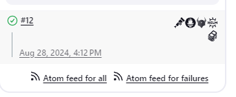
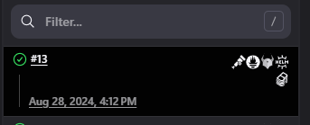

# oss-symbols-api-plugin

Jenkins API Plugin that provide logo of common OpenSource tools also known as "symbols", for your Jenkins plugins.

[](https://ci.jenkins.io/job/plugins/job/oss-symbols-api-plugin/)
[](https://plugins.jenkins.io/oss-symbols-api/)
[](https://plugins.jenkins.io/oss-symbols-api/)
[](https://github.com/jenkinsci/oss-symbols-api-plugin/graphs/contributors)

## Usage

This plugin provides some tools logo of common OpenSource tools also known as "symbols", for your Jenkins plugins.

Source of the SVG are from

- https://github.com/cdfoundation/artwork
- https://github.com/cncf/artwork

All icons are trademarks of their respective owners. The use of these trademarks does not indicate endorsement of the trademark holder, nor vice versa.

Refer to the previous list for the trademark policy of each organization.

Add the oss-symbols-api as dependency to your `pom.xml`:

To use a symbol, reference the icon as following:

### Jelly
```xml
<l:icon src="symbol-symbolName plugin-oss-symbols-api" />
```

### Groovy
```groovy
l.icon(src:"symbol-symbolName plugin-oss-symbols-api")
```

### Java

```java
@Override
public String getIconClassName() {
    return "symbol-symbolName plugin-oss-symbols-api";
}
```

One example is the usage with the badge plugin:

```groovy
node {
    addBadge(icon: "symbol-prometheus-icon-solid plugin-oss-symbols-api")
}
```

See https://plugins.jenkins.io/badge/ for more details.

Symbol supports standard and dark theme for solid icon




Color is also supported


## LICENSE

Licensed under MIT, see [LICENSE](LICENSE.md)

